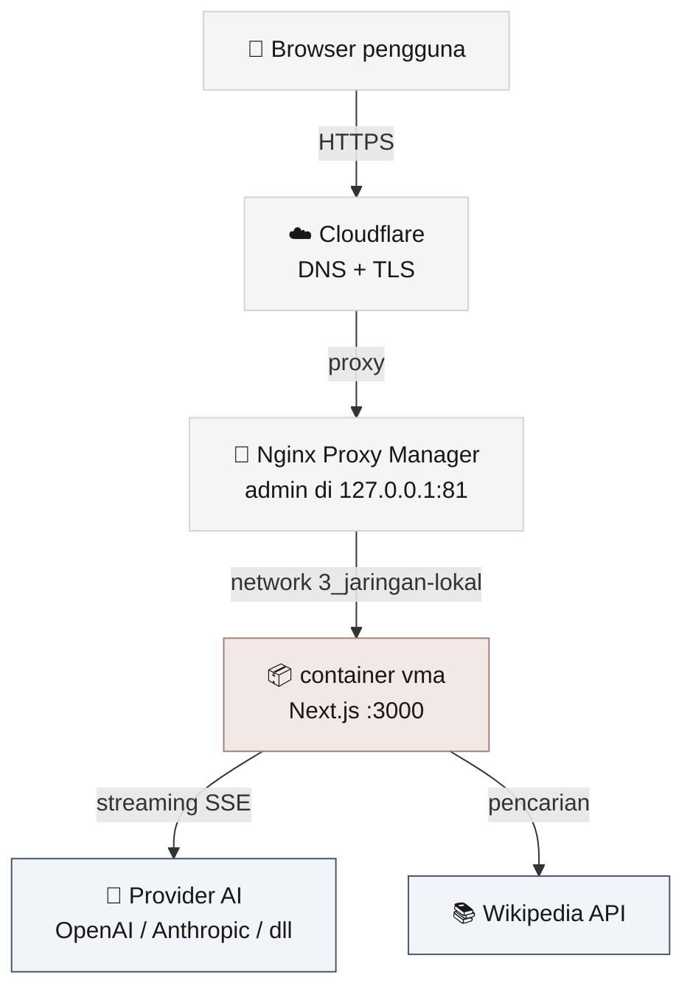
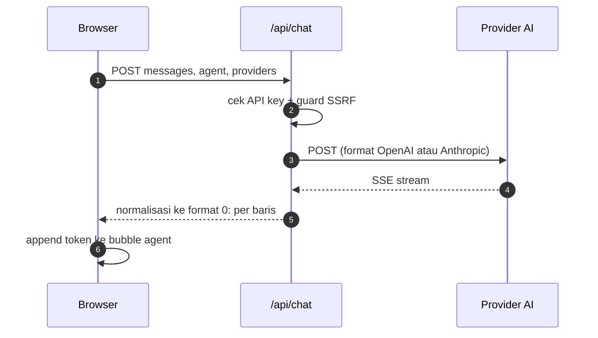

# 🏗️ Arsitektur

> [!abstract] Inti
> VMA adalah aplikasi **client-heavy**. Seluruh state pengguna hidup di browser (localStorage + IndexedDB). Server hanya dipakai sebagai **proxy streaming** ke penyedia AI, supaya API key tidak perlu dikirim dari browser langsung ke provider (menghindari CORS dan menyembunyikan asal request).

[[VMA|← Kembali ke Home]]

---

## 1. Stack

| Lapisan | Teknologi | Catatan |
| --- | --- | --- |
| Framework | Next.js 16 (App Router) | `output: standalone` untuk Docker |
| UI | React 19 | Semua komponen chat ber-`'use client'` |
| State | Zustand 5 | Persist manual ke localStorage |
| Styling | Tailwind CSS 4 | Token via `@theme` di `globals.css` |
| Bahasa | TypeScript 7 | `strict: true` |
| AI | Vercel AI SDK 7 | `@ai-sdk/openai`, `@ai-sdk/anthropic` |
| Dokumen | `idb` 8 | Wrapper IndexedDB |
| Build | webpack | Turbopack gagal resolve native `lightningcss` |

> [!warning] Kenapa webpack, bukan Turbopack
> Turbopack (default Next 16) tidak bisa me-resolve binary native `lightningcss` saat mengevaluasi config PostCSS/Tailwind di build time. Dockerfile memakai `npx next build --webpack`. Detail: [[08 Troubleshooting]].

---

## 2. Struktur Folder

```
src/
├── app/                      # Routing Next.js
│   ├── layout.tsx            # Root html/body
│   ├── page.tsx              # Redirect ke /app
│   ├── globals.css           # Design token + keyframes
│   ├── login/page.tsx        # Halaman login
│   ├── app/
│   │   ├── layout.tsx        # Sidebar kiri + main + sidebar kanan
│   │   ├── page.tsx          # Halaman chat utama
│   │   └── rooms/[id]/       # Room per session
│   └── api/
│       ├── auth/login/       # Verifikasi kredensial
│       ├── auth/logout/      # Hapus cookie
│       ├── chat/             # Proxy streaming ke provider AI
│       └── search/           # Pencarian Wikipedia
│
├── components/
│   ├── chat/                 # Bubble, interpreter, preview, dsb.
│   ├── input/                # InputBar (@mention, upload)
│   ├── layout/               # Sidebar, topbar, loop control
│   ├── modals/               # 5 modal konfigurasi
│   └── sessions/             # Item daftar sesi
│
├── hooks/useChat.ts          # Otak percakapan
├── lib/                      # auth, rateLimit, netGuard, db, markdown, utils
├── store/                    # 7 store Zustand
├── types/                    # Kontrak TypeScript
└── proxy.ts                  # Gate autentikasi (Next 16)
```

> [!note] `middleware.ts` sudah tidak dipakai
> Next.js 16 mengganti konvensi `middleware` menjadi `proxy`. File kita bernama `src/proxy.ts` dan mengekspor fungsi `proxy`. Kalau keduanya ada, build akan error.

---

## 3. Diagram Sistem (Produksi)



> [!info] Kenapa NPM meneruskan ke nama container, bukan `127.0.0.1`
> NPM jalan **di dalam container**. Kalau diarahkan ke `127.0.0.1:3100`, dia menunjuk ke dirinya sendiri dan hasilnya `502`. Solusinya: container `vma` disambungkan ke network `3_jaringan-lokal` yang sama, lalu diarahkan ke `vma:3000`.

---

## 4. Tiga Jalur Data

### 4.1 State pengguna (tanpa server)
```
Zustand store  →  localStorage (JSON)
Dokumen        →  IndexedDB
```

Isi localStorage:

| Key | Isi |
| --- | --- |
| `vma-sessions` | Daftar sesi |
| `vma-active-session` | ID sesi aktif |
| `vma-messages` | Semua pesan per sesi |
| `vma-agents` | Definisi agent |
| `vma-providers` | Provider + API key |
| `vma-moderator` | Provider/model moderator |

### 4.2 Streaming chat



> [!tip] Normalisasi SSE
> Baik Anthropic maupun provider OpenAI-compatible dikonversi ke satu format internal (`0:"teks"` per baris). Sisi klien cukup punya satu parser.

### 4.3 Dokumen (IndexedDB)
```
Upload file → readFileAsText → simpan { id, name, type, size, content, agentId }
```

`agentId` kosong berarti knowledge base **general**, terisi berarti milik agent tertentu.

---

## 5. Modul Pendukung

| File | Tanggung jawab |
| --- | --- |
| `lib/ai/providers.ts` | Factory provider (OpenAI, Anthropic, OpenAI-compatible) |
| `lib/auth.ts` | Token sesi HMAC + verifikasi password PBKDF2 |
| `lib/rateLimit.ts` | Throttle per-IP dan backstop global |
| `lib/netGuard.ts` | Tolak `baseUrl` ke alamat privat (anti SSRF) |
| `lib/db.ts` | Buka IndexedDB, CRUD dokumen |
| `lib/markdown.ts` | Renderer markdown ringan ke HTML |
| `lib/utils.ts` | `cn()`, `generateId()`, format waktu |

---

## 6. Keputusan Desain

> [!quote] Alasan di balik pilihan utama
> - **State di browser**: menghilangkan kebutuhan backend dan database, sesuai prinsip anti vendor lock-in.
> - **Server sebagai proxy**: API key tidak dikirim langsung dari browser ke provider, menghindari CORS sekaligus menyembunyikan detail request.
> - **Antrian berjenjang (staggered)**: agent dipanggil dengan jeda agar terasa seperti percakapan, bukan tembakan serentak.
> - **Token Tailwind di CSS**: satu sumber kebenaran warna, dipakai konsisten di seluruh komponen.

---

Terkait: [[02 Alur Debat]] · [[03 Model Data]] · [[06 Deployment]]

