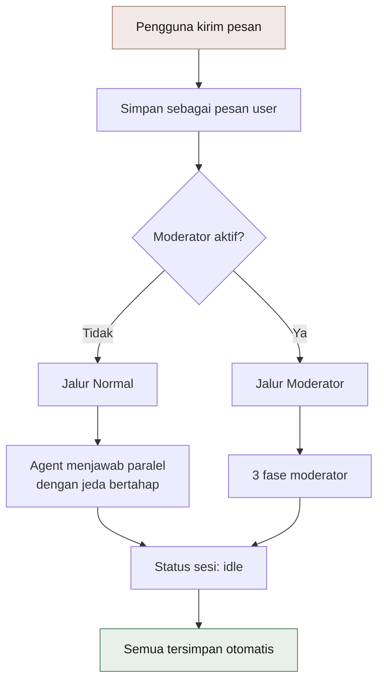
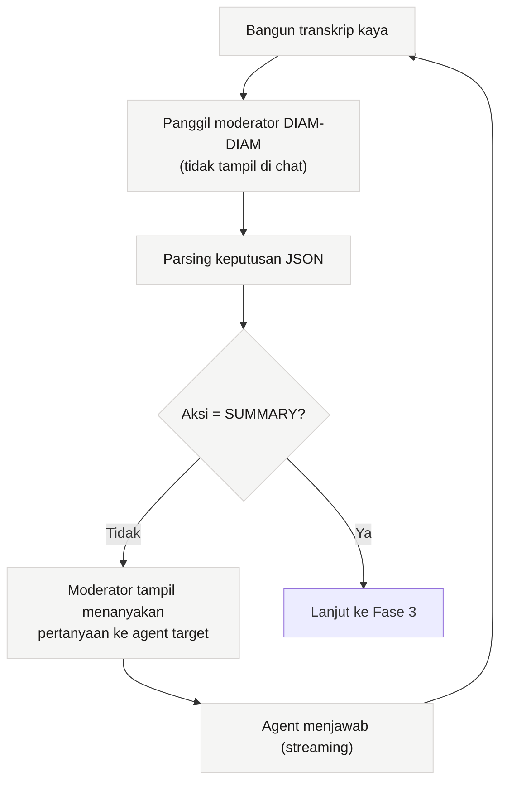

# 🔄 Alur Debat

> [!abstract] Inti
> Setiap kali pengguna mengirim pesan, sistem memilih satu dari **dua jalur**: **Normal** (semua agent menjawab) atau **Moderator** (AI memandu satu per satu). Jalur Moderator punya loop agentik yang memutuskan sendiri kapan diskusi selesai.

[[VMA|← Kembali ke Home]] · [[01 Arsitektur]]

---

## 1. Siklus Satu Pesan



---

## 2. Menentukan Siapa yang Menjawab

Mode respons ditentukan oleh cara pengguna menulis:

| Cara menulis | Efek |
| --- | --- |
| `@Maya` | Hanya Maya yang menjawab |
| `@all` | Semua agent di room menjawab |
| Tanpa tag | **Auto-select** berdasarkan skor relevansi |

> [!info] Cara kerja auto-select
> Teks agent (`roleTitle + name + systemPrompt`) dicocokkan dengan kata kunci pertanyaan. Setiap kata kunci yang muncul di **keduanya** menambah skor 1. Agent dengan skor tertinggi dipilih (maksimal 2). Kalau tidak ada yang cocok, agent pertama yang dipakai.
>
> Kata kunci: `finance, sales, legal, money, law, revenue, contract, invest, cost, risk, tax, hiring, marketing, budget, debt, profit, cashflow, litigation, compliance, pricing`

---

## 3. Jalur Moderator: Tiga Fase

Moderator adalah **entitas virtual**, bukan salah satu agent peserta. Ia memakai provider dan model tersendiri yang diatur di modal API Keys.

### Fase 1: Membuka

Moderator menerima pertanyaan + daftar peserta, lalu memanggil agent **paling relevan** untuk membuka diskusi.

> [!example] Contoh
> Topik keuangan, moderator membuka dengan:
> *"Aldo, sebagai finance advisor, bagaimana menurutmu soal ini?"*

### Fase 2: Loop Agentik



> [!warning] Batas loop adaptif
> - 2 agent: maksimal **6** giliran
> - 3-4 agent: maksimal **9** giliran
> - 5+ agent: maksimal **12** giliran
>
> Batas ini mencegah diskusi berputar tanpa ujung dan menekan biaya token.

### Fase 3: Ringkasan

Moderator menerima **transkrip penuh** lalu menyusun ringkasan terstruktur yang menutup sesi.

---

## 4. Transkrip Kaya

Sebelum moderator memutuskan, sistem membangun transkrip yang sudah diperkaya metadata:

| Informasi | Isi |
| --- | --- |
| **Fase** | EXPLORATION / DEEPENING / RESOLUTION |
| **Belum bicara** | Agent yang belum merespons sejak pesan terakhir |
| **Kualitas** | Tag `[SHALLOW]` (< 80 kata), `[RICH]` (> 200 kata) |
| **Konflik** | Pasangan jawaban yang saling bertentangan |
| **Relasi** | Siapa menyebut nama siapa |
| **Kompleksitas** | Perkiraan dari panjang pertanyaan dan jumlah domain |
| **Waktu** | Menit sejak pesan terakhir pengguna |
| **Hitungan lanjutan** | Berapa kali moderator sudah follow-up |

> [!tip] Kenapa metadata ini penting
> Tanpa metadata, moderator cenderung mengulang pertanyaan yang sama. Dengan metadata, keputusannya kontekstual: ia tahu siapa yang belum bicara, jawaban mana yang dangkal, dan di mana terjadi perbedaan pendapat.

---

## 5. Aksi Moderator

| Aksi | Kapan dipakai |
| --- | --- |
| `FOLLOWUP` | Lanjut ke agent berikutnya sesuai domain |
| `CLARIFY` | Jawaban terlalu dangkal |
| `CHALLENGE` | Tidak ada bukti atau data pendukung |
| `BRIDGE` | Dua agent bertentangan, minta rekonsiliasi |
| `ELABORATE` | Minta pendalaman satu aspek |
| `REDIRECT` | Diskusi keluar dari topik |
| `MULTI` | Panggil beberapa agent sekaligus |
| `POLL` | Minta pendapat semua peserta |
| `SUMMARY` | Tutup diskusi |

### Format keputusan

**Format utama (JSON):**
```json
{
  "action": "FOLLOWUP",
  "agents": ["Maya"],
  "question": "Bagaimana dampaknya ke pipeline Q4?",
  "topic": "SALES"
}
```

**Format cadangan (kalau JSON gagal di-parse):**
```
ACTION: FOLLOWUP
AGENT: Maya
QUESTION: Bagaimana dampaknya ke pipeline Q4?
```

> [!note] Fallback yang aman
> Kalau kedua format tidak cocok, aksi dianggap `SUMMARY` supaya diskusi berhenti dengan rapi, bukan menggantung.

---

## 6. Aturan Bahasa

> [!important] Selalu ikut bahasa pengguna
> Setiap agent dan moderator punya aturan eksplisit: **jawab dengan bahasa yang sama seperti pengguna**. Pengguna menulis Indonesia, jawabannya Indonesia. Aturan ini ditanam di system prompt, bukan disimpulkan sendiri oleh model.

---

## 7. Jeda Bertahap (Staggered)

Agent tidak dipanggil serentak. Ada jeda antar pemanggilan supaya:

- Bubble muncul berurutan, terasa seperti percakapan nyata
- Beban rate limit provider tidak menumpuk di satu detik
- Pengguna bisa membaca jawaban pertama sambil menunggu berikutnya

Kecepatan jeda mengikuti **Loop Speed** di pengaturan: `slow`, `normal`, `fast`.

---

Terkait: [[03 Model Data]] · [[04 Fitur]] · [[07 Keamanan]]
