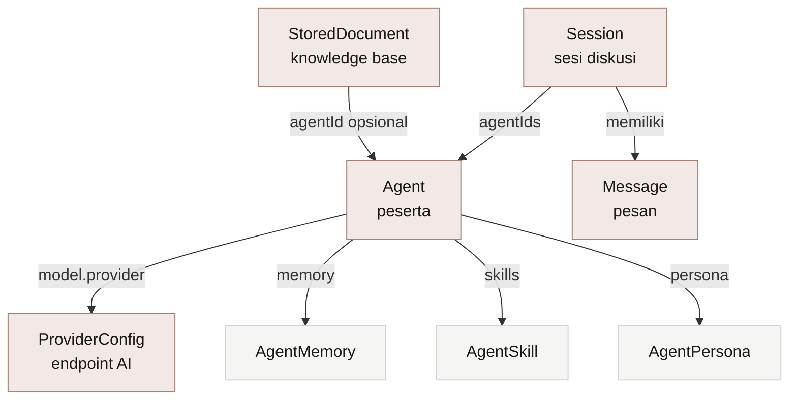

# 🗃️ Model Data

> [!abstract] Inti
> Semua kontrak data ada di `src/types/`. Tidak ada ORM dan tidak ada migrasi karena penyimpanannya adalah localStorage dan IndexedDB, yang menerima JSON apa adanya.

[[VMA|← Kembali ke Home]] · [[01 Arsitektur]]

---

## 1. Peta Tipe



---

## 2. Agent

```ts
interface Agent {
  id: string
  name: string
  roleTitle: string
  tone: 'debate' | 'supportive' | 'expert'
  avatarColor: string
  model: { provider: string; modelName: string; temperature?: number }
  systemPrompt: string
  persona: AgentPersona
  skills: AgentSkill[]
  webSearch: boolean
  memory: AgentMemory[]
  createdAt: number
  updatedAt: number
}
```

### Persona

| Field | Tipe | Arti |
| --- | --- | --- |
| `personality` | string | Deskripsi watak |
| `communicationStyle` | string | Gaya bicara |
| `values` | string[] | Nilai yang dipegang |
| `biases` | string | Kecenderungan yang disadari |
| `agreeableness` | 0-1 | Seberapa mudah setuju |
| `confidence` | 0-1 | Tingkat keyakinan |
| `depth` | 0-1 | Kedalaman jawaban |
| `steelmansOthers` | boolean | Menyajikan argumen lawan dengan kuat |
| `admitsUncertainty` | boolean | Mengakui ketidaktahuan |
| `usesRealExamples` | boolean | Memakai contoh nyata |
| `challengesAssumptions` | boolean | Menantang asumsi |

### Tiga agent bawaan

| Nama | Peran | Tone | Warna | Ciri |
| --- | --- | --- | --- | --- |
| **Maya** | VP of Sales | `debate` | 🟢 `#4a7c59` | Lugas, berani, fokus pendapatan. `agreeableness` 0.3 |
| **Aldo** | Finance Advisor | `expert` | 🟠 `#b45309` | Teliti, berbasis angka, konservatif. `depth` 0.8 |
| **Sinta** | Legal Counsel | `expert` | 🔵 `#475569` | Sadar risiko, patuh regulasi. `depth` 0.9 |

> [!tip] Palet avatar agent
> `AGENT_COLORS` menyediakan 8 warna: `#4a7c59`, `#b45309`, `#475569`, `#7c3aed`, `#be123c`, `#0e7490`, `#c2410c`, `#6d28d9`.

---

## 3. Session

```ts
interface Session {
  id: string
  name: string
  agentIds: string[]
  presetMode: PresetMode
  settings: SessionSettings
  status: 'idle' | 'running' | 'paused'
  currentRound: number
  responseMode: 'all' | 'auto' | 'tag'
  createdAt: number
  updatedAt: number
  lastMessageAt?: number
}
```

### Preset Mode

| Mode | Ikon | Bawaan | Deskripsi |
| --- | --- | --- | --- |
| Boardroom | ◻ | normal, 2 giliran | Debat terstruktur untuk keputusan berisiko tinggi |
| Supportive | ○ | slow, 3 giliran | Kolaboratif, saling membangun ide |
| Learning | △ | slow, 3 giliran | Saling mengajar dan menguji pemahaman |
| War Room | ◇ | fast, 1 giliran | Brainstorming cepat di bawah tekanan |
| Custom | · | normal, tak terbatas | Atur sendiri |

### Pengaturan sesi

| Field | Nilai | Default |
| --- | --- | --- |
| `loopSpeed` | `slow` / `normal` / `fast` | `normal` |
| `maxRounds` | angka / `unlimited` | `unlimited` |
| `moderatorEnabled` | boolean | `false` |
| `roleLock` | boolean | `false` |

---

## 4. Message

```ts
interface Message {
  id: string
  sessionId: string
  role: 'user' | 'agent' | 'system' | 'moderator'
      | 'code' | 'browser' | 'ppt' | 'search' | 'ocr'
  agentId?: string
  content: string
  attachments?: Attachment[]
  metadata?: { ... }
  createdAt: number
}
```

> [!info] Sembilan jenis role
> Selain `user`, `agent`, `system`, dan `moderator`, ada role khusus yang memicu renderer berbeda di [[01 Arsitektur|ChatArea]]: `code` (interpreter), `browser` (screenshot), `ppt` (presentasi), `search` (hasil pencarian), dan `ocr` (teks hasil ekstraksi gambar).

### Metadata opsional

| Field | Dipakai untuk |
| --- | --- |
| `model`, `tokens`, `cost`, `duration` | Statistik di TokenMeter |
| `round` | Nomor giliran |
| `code`, `language`, `output`, `outputImages` | Hasil eksekusi kode |
| `url`, `screenshot` | Tampilan browser |
| `html` | Preview HTML |
| `pptFilename`, `pptSlides` | Presentasi |
| `searchResults`, `searchQuery`, `searchSource` | Hasil pencarian |
| `ocrText`, `ocrLanguage` | Hasil OCR |

---

## 5. Provider

```ts
interface ProviderConfig {
  id: string
  name: string
  baseUrl: string
  apiKey: string
  models: { id: string; name: string; temperature?: number }[]
  enabled: boolean
}
```

### Provider bawaan

| ID | Nama | Base URL |
| --- | --- | --- |
| `openai` | OpenAI | `https://api.openai.com/v1` |
| `anthropic` | Anthropic | `https://api.anthropic.com` |
| `openrouter` | OpenRouter | `https://openrouter.ai/api/v1` |
| `ollama` | Ollama (lokal) | `http://localhost:11434/v1` |

> [!warning] Ollama dan guard SSRF
> `localhost` diblokir oleh guard SSRF di produksi. Kalau kamu benar-benar memakai Ollama di server yang sama, set `VMA_ALLOW_PRIVATE_BASEURL=true`. Lihat [[07 Keamanan]].

---

## 6. Dokumen

```ts
interface StoredDocument {
  id: string
  name: string
  type: string
  size: number
  content: string
  agentId?: string    // kosong = knowledge base general
  createdAt: number
}
```

Tersimpan di IndexedDB `vma-documents` (versi 2), object store `files`, dengan index `agentId`.

---

Terkait: [[02 Alur Debat]] · [[04 Fitur]] · [[05 Design System]]
