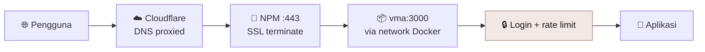

# 🚀 Deployment

> [!abstract] Ringkasan
> VMA berjalan sebagai satu container Docker di VPS, di balik Nginx Proxy Manager dan Cloudflare. Deploy ulang berarti tiga langkah: tarik kode, bangun image, nyalakan container.

[[VMA|← Kembali ke Home]] · [[07 Keamanan]]

---

## 1. Topologi Produksi

| Item | Nilai |
| --- | --- |
| Host | `176.100.37.158`, user `yordan` |
| URL | https://vma.yordangabriell.my.id |
| Lokasi kode di server | `~/apps/vma` |
| Container | `vma` (node:22-alpine, Next.js standalone) |
| Port | `3000` di container, `127.0.0.1:3100` di host |
| Reverse proxy | Nginx Proxy Manager, proxy host id **7** |
| Network Docker | `3_jaringan-lokal` (bersama NPM) + `vma_default` |
| Sertifikat | Let's Encrypt, id **11** |

---

## 2. Alur Request



---

## 3. File Deployment

| File | Fungsi |
| --- | --- |
| `Dockerfile` | Build 3 tahap: deps, builder, runner |
| `docker-compose.yml` | Layanan, port, env, network, healthcheck |
| `.dockerignore` | Kecualikan `node_modules`, `.next`, `.git`, env |
| `.env` | Rahasia, **tidak** masuk git |
| `.env.example` | Cetakan tanpa nilai asli |
| `public/.gitkeep` | Placeholder folder |

> [!warning] Kenapa build memakai `--webpack`
> Turbopack tidak bisa me-resolve binary native `lightningcss` saat mengevaluasi config PostCSS/Tailwind. Dockerfile memakai `npx next build --webpack`. Detail: [[08 Troubleshooting]].

---

## 4. Runbook: Deploy Pertama Kali

> [!example] Langkah lengkap
> ```bash
> # 1. SSH ke server
> ssh -i ~/.ssh/yordan_vps yordan@176.100.37.158
>
> # 2. Ambil kode
> mkdir -p ~/apps && cd ~/apps
> git clone https://github.com/yordangabriell12/mvp-multi-agent-debate.git vma
> cd vma
>
> # 3. Buat .env (isi rahasia, lihat [[Kredensial]])
> cat > .env <<'EOF'
> VMA_AUTH_EMAIL=...
> VMA_AUTH_PASSWORD_HASH=...
> VMA_SESSION_SECRET=...
> VMA_ALLOW_PRIVATE_BASEURL=false
> EOF
> chmod 600 .env
>
> # 4. Bangun dan nyalakan
> docker compose build
> docker compose up -d
> ```

Lalu di Nginx Proxy Manager, buat proxy host:

| Field | Nilai |
| --- | --- |
| Domain | `vma.yordangabriell.my.id` |
| Forward Hostname | `vma` |
| Forward Port | `3000` |
| Scheme | `http` |
| Websockets | aktif |
| SSL | Let's Encrypt, Force SSL |

---

## 5. Runbook: Update Rutin

> [!tip] Setelah ada perubahan kode
> ```bash
> ssh -i ~/.ssh/yordan_vps yordan@176.100.37.158
> cd ~/apps/vma
> git pull --ff-only
> docker compose build
> docker compose up -d
> docker compose ps
> ```
> Langkah `build` memakan waktu sekitar 2 sampai 3 menit.

---

## 6. Mengubah Kredensial Login

> [!example] Ganti password
> ```bash
> # Lokal: buat hash baru (pakai pemisah titik dua)
> node scripts/hash-password.mjs 'password-baru'
>
> # Di server: sunting .env, ganti VMA_AUTH_PASSWORD_HASH
> nano ~/apps/vma/.env
>
> # Terapkan (tidak perlu build ulang, env dibaca saat runtime)
> cd ~/apps/vma && docker compose up -d
> ```

> [!important] Jangan pakai tanda dolar di `.env`
> Docker Compose menganggap `$` sebagai awal variabel dan akan mengosongkan nilainya. Itu sebabnya format hash memakai pemisah `:` bukan `$`. Detail: [[08 Troubleshooting]].

---

## 7. Variabel Lingkungan

| Variabel | Wajib | Bawaan | Fungsi |
| --- | --- | --- | --- |
| `VMA_AUTH_EMAIL` | ya | | Email login |
| `VMA_AUTH_PASSWORD_HASH` | ya | | Hash PBKDF2 dari password |
| `VMA_AUTH_PASSWORD` | tidak | | Password teks asli, hanya fallback. Tidak disarankan |
| `VMA_SESSION_SECRET` | ya | | Kunci HMAC penanda tangan cookie |
| `VMA_ALLOW_PRIVATE_BASEURL` | tidak | `false` | Set `true` hanya kalau provider AI ada di jaringan privat |
| `VMA_CHAT_MAX_REQUESTS` | tidak | `150` | Batas panggilan `/api/chat` per IP |
| `VMA_CHAT_WINDOW_SECONDS` | tidak | `300` | Jendela waktu untuk batas di atas |
| `VMA_MAX_BODY_BYTES` | tidak | `1000000` | Ukuran body maksimal untuk `/api/chat` |

> [!tip] Kalau sering kena 429
> Mode moderator dengan banyak agent memanggil `/api/chat` berkali-kali per giliran. Naikkan batasnya kalau pemakaian normal ikut terblokir:
> ```
> VMA_CHAT_MAX_REQUESTS=400
> VMA_CHAT_WINDOW_SECONDS=300
> ```
> Lalu `docker compose up -d`. Hitungannya disimpan di memori proses, jadi restart mengosongkannya.

---

## 8. Perintah Harian

| Kebutuhan | Perintah |
| --- | --- |
| Lihat status | `docker compose ps` |
| Lihat log | `docker compose logs -f vma` |
| Restart | `docker compose restart vma` |
| Masuk ke container | `docker exec -it vma sh` |
| Hentikan | `docker compose down` |
| Cek dari host | `curl -s -o /dev/null -w '%{http_code}\n' http://127.0.0.1:3100/login` |

---

## 9. Checklist Setelah Deploy

> [!success] Verifikasi wajib
> - [ ] `docker compose ps` menampilkan status `healthy`
> - [ ] `https://vma.yordangabriell.my.id/login` membalas `200`
> - [ ] Membuka `/app` tanpa login dialihkan ke `/login`
> - [ ] Login dengan kredensial benar berhasil masuk
> - [ ] Login dengan password salah ditolak
> - [ ] Sertifikat SSL masih berlaku di NPM
> - [ ] Tidak ada error di `docker compose logs`

---

## 10. Backup

VMA menyimpan seluruh data pengguna di **browser**, jadi tidak ada data aplikasi di server yang perlu di-backup. Yang perlu disimpan hanyalah:

- File `~/apps/vma/.env` (berisi kredensial dan secret)
- Konfigurasi proxy host NPM (sudah tercakup backup Docker harian di `/root/backups/`)
- Sertifikat Let's Encrypt (juga tercakup backup harian)

> [!note] Backup otomatis yang sudah ada
> Server sudah punya script `/root/backup-docker.sh` yang jalan tiap pukul 03:00 dan menyimpan data NPM serta sertifikat dengan retensi 7 hari.

---

Terkait: [[07 Keamanan]] · [[08 Troubleshooting]] · [[09 Changelog]]
