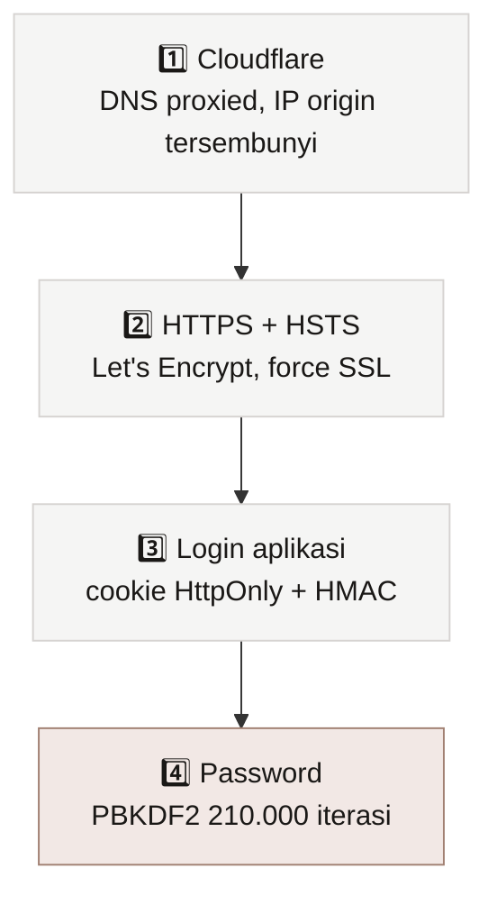
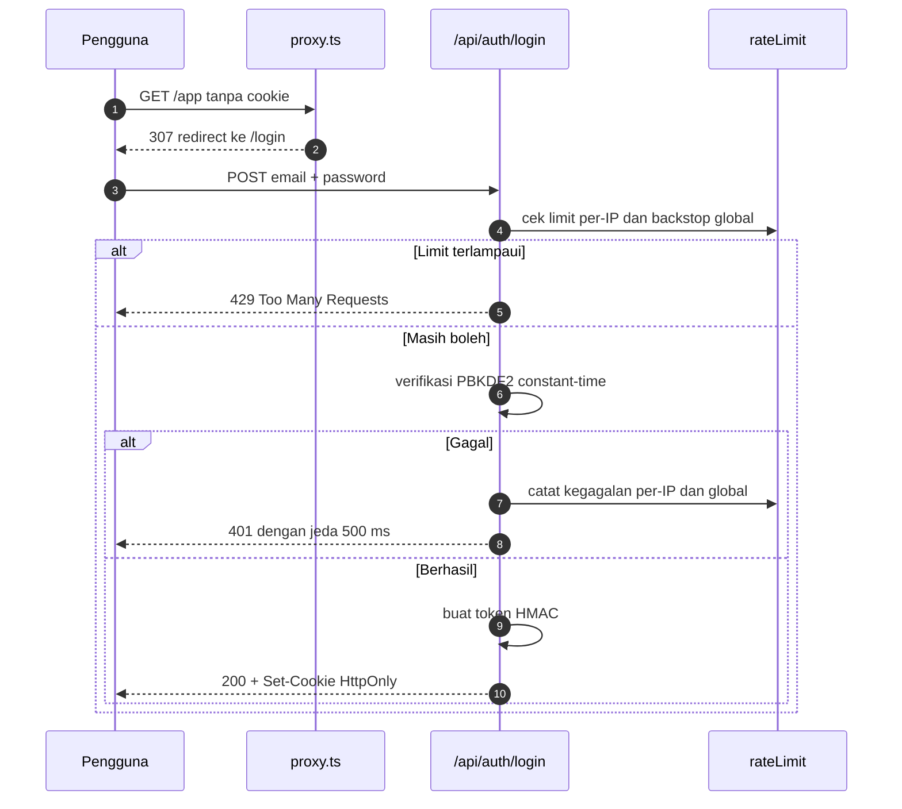

# 🔒 Keamanan

> [!abstract] Ringkasan
> Akses dijaga empat lapis: Cloudflare, HTTPS dengan HSTS, login aplikasi, dan verifikasi password yang mahal. Ditambah dua pertahanan khusus: **rate limit anti brute force** dan **guard SSRF**.

[[VMA|← Kembali ke Home]] · [[06 Deployment]]

---

## 1. Empat Lapis



| Lapis | Isi |
| --- | --- |
| **1. Cloudflare** | DNS proxied, IP asli server tidak terekspos |
| **2. HTTPS** | Let's Encrypt, `ssl_forced`, HSTS `max-age=31536000` |
| **3. Login** | Cookie `HttpOnly` + `Secure` + `SameSite=strict`, HMAC-SHA256, berlaku 12 jam |
| **4. Password** | PBKDF2-SHA256, 210.000 iterasi, salt 16 byte, perbandingan constant-time |

---

## 2. Alur Login



> [!important] Semua route di balik gate
> `src/proxy.ts` memeriksa cookie sesi untuk setiap permintaan. Halaman dialihkan ke `/login`, sementara endpoint API membalas `401` JSON. Yang dikecualikan hanya `/login`, dua endpoint auth, dan aset statis.

---

## 3. Anti Brute Force

Tiga mekanisme bekerja bersamaan:

### 3.1 Limit per-IP
**5** percobaan gagal dalam 15 menit, lalu alamat itu terkunci **15 menit**.

### 3.2 Jeda tiap kegagalan
Setiap kegagalan menambah jeda **500 ms** sebelum respons dikirim, sehingga percobaan otomatis menjadi lambat.

### 3.3 Backstop global
> [!warning] Ini yang menutup celah spoofing
> Limit per-IP mengambil kunci dari header. Kalau penyerang tahu IP origin dan menyambung **langsung** (melewati Cloudflare), header `X-Forwarded-For` bisa dipalsukan dan setiap permintaan tampak datang dari IP berbeda.
>
> Hitungan byte tidak bisa dipalsukan, jadi sistem juga mencatat kegagalan secara **global**:
> - Lewat **15** kegagalan dalam 10 menit: jeda naik bertahap sampai 3,5 detik
> - Lewat **40** kegagalan: seluruh login ditolak selama 2 menit

### Urutan header yang dipercaya

```ts
// Cloudflare menimpa header ini di setiap permintaan yang dilewatkannya
const cfIp = req.headers.get('cf-connecting-ip')
if (cfIp) return cfIp
// Cadangan
const forwarded = req.headers.get('x-forwarded-for')
```

> [!tip] Hasil pengujian
> 42 percobaan dengan IP palsu berbeda-beda tiap request: percobaan 1 sampai 40 membalas `401` dengan jeda naik dari 564 ms ke 3554 ms, lalu percobaan 41 dan seterusnya membalas `429`. Sementara itu login yang sah tetap membalas `200`.

---

## 4. Guard SSRF

> [!danger] Kenapa ini penting
> Endpoint `/api/chat` menerima `providers[].baseUrl` dari body permintaan lalu melakukan `fetch()` **dari server**. Tanpa pemeriksaan, siapa pun yang bisa login dapat mengarahkannya ke layanan internal, misalnya `http://127.0.0.1:81` (admin NPM) atau `169.254.169.254` (metadata cloud).

`src/lib/netGuard.ts` menolak:

- Protokol selain `http` dan `https`
- Nama host: `localhost`, `metadata`, `metadata.google.internal`, dan sejenisnya
- Sufiks: `.local`, `.internal`, `.home.arpa`
- IPv4 privat: `10.x`, `172.16-31.x`, `192.168.x`, `127.x`, `169.254.x`, `100.64-127.x`
- IPv6 privat: `::1`, `fc00::/7`, `fe80::/10`
- IPv4-mapped dalam bentuk apa pun

> [!bug] Celah yang ditemukan lewat test
> Pemeriksaan IPv4-mapped semula tidak pernah aktif. Parser URL bukan hanya menerima bentuk bertitik: `::ffff:127.0.0.1` ditulis ulang menjadi `::ffff:7f00:1` (hex), sehingga pola bertitik tidak cocok dan loopback tetap bisa dijangkau. Kedua bentuk kini ditangani, termasuk bentuk panjang `0:0:0:0:0:ffff:127.0.0.1`.
>
> Celah ini ditemukan oleh `src/lib/netGuard.test.ts`, bukan oleh pemeriksaan manual.

> [!note] Kalau kamu memang butuh provider lokal
> Set `VMA_ALLOW_PRIVATE_BASEURL=true` untuk mematikan guard ini. Hanya lakukan kalau provider AI kamu benar-benar berada di jaringan privat, misalnya Ollama yang di-host sendiri.

---

## 5. Header Keamanan

| Header | Nilai |
| --- | --- |
| `Strict-Transport-Security` | `max-age=31536000; includeSubDomains` |
| `X-Frame-Options` | `DENY` |
| `X-Content-Type-Options` | `nosniff` |
| `Referrer-Policy` | `strict-origin-when-cross-origin` |
| `Permissions-Policy` | `camera=(), microphone=(), geolocation=()` |

---

## 5b. Pengaman Biaya di `/api/chat`

> [!important] Endpoint termahal, bukan endpoint login
> Login sudah dijaga berlapis, tetapi `/api/chat` yang justru **mengeluarkan biaya** sempat terbuka. Cookie yang bocor, atau klien yang lepas kendali, bisa memanggil provider AI tanpa batas.

| Pengaman | Bawaan | Ubah lewat |
| --- | --- | --- |
| Batas permintaan per IP | 150 per 5 menit | `VMA_CHAT_MAX_REQUESTS`, `VMA_CHAT_WINDOW_SECONDS` |
| Ukuran body maksimal | 1 MB | `VMA_MAX_BODY_BYTES` |

> [!tip] Kenapa angkanya longgar
> Satu giliran debat memanggil endpoint ini berkali-kali: setiap keputusan moderator, setiap jawaban agent, dan setiap pemeriksaan konsensus adalah satu permintaan. Batas yang ketat akan memutus pemakaian normal. Tujuannya menahan klien yang lepas kendali, bukan membatasi pemakaian wajar.
>
> Body dibaca sebagai teks lebih dulu dan ditolak dengan `413` sebelum di-parse, jadi payload raksasa tidak pernah masuk ke parser JSON.

---

## 6. Penyimpanan Rahasia

> [!danger] Aturan
> - Rahasia hanya ada di `~/apps/vma/.env` di server, izin `600`
> - `.env` **tidak** pernah masuk git (sudah ada di `.gitignore`)
> - Password disimpan sebagai hash PBKDF2, bukan teks asli
> - API key milik pengguna tersimpan di browser masing-masing, tidak pernah di server

Format hash:

```
pbkdf2:<iterasi>:<salt-base64url>:<hash-base64url>
```

> [!important] Kenapa titik dua, bukan dolar
> Docker Compose memperlakukan `$` di file `.env` sebagai awal variabel. Versi awal memakai pemisah `$` dan hash-nya terhapus diam-diam sehingga login selalu gagal. Pemisah `:` tidak punya masalah itu. Detail: [[08 Troubleshooting]].

---

## 7. Model Ancaman

| Ancaman | Penanganan |
| --- | --- |
| Tebak password | Rate limit per-IP + backstop global + jeda |
| Tebak password lewat banyak IP | Backstop global berbasis hitungan byte |
| Pencurian cookie | `HttpOnly`, `Secure`, `SameSite=strict` |
| Penyadapan di jaringan | HTTPS + HSTS |
| Pemalsuan sesi | Token ditandatangani HMAC-SHA256 |
| SSRF ke layanan internal | `netGuard` menolak alamat privat |
| Kebocoran rahasia lewat git | `.env` di-*gitignore*, hash bukan teks asli |
| DDoS | Ditangani di lapisan Cloudflare |

### Risiko yang masih ada

> [!warning] Jujur soal sisa risiko
> - **IP origin bisa ditemukan**: kalau itu terjadi, penyerang bisa melewati Cloudflare. Pertahanan tetap ada di lapisan aplikasi (login, rate limit, SSRF guard).
> - **Rate limit disimpan di memori**: kalau nanti dijalankan lebih dari satu replika, hitungan menjadi per-replika dan perlu dipindah ke penyimpanan bersama seperti Redis.
> - **Tidak ada 2FA**: autentikasi hanya satu faktor.
> - **Password Portainer dan open-webui** masih perlu diganti secara manual.

---

## 8. Kalau Diduga Dibobol

> [!danger] Langkah tanggap
> 1. Ganti password login VMA **dan** `VMA_SESSION_SECRET`. Mengganti secret otomatis membatalkan semua sesi aktif.
> 2. ```bash
>    cd ~/apps/vma
>    nano .env          # ganti hash dan secret
>    docker compose up -d
>    ```
> 3. Rotasi semua API key provider AI yang pernah dipasang
> 4. Periksa `docker compose logs vma` untuk pola permintaan aneh
> 5. Periksa log NPM di `/data/logs/` di dalam container NPM

---

Terkait: [[06 Deployment]] · [[08 Troubleshooting]]

