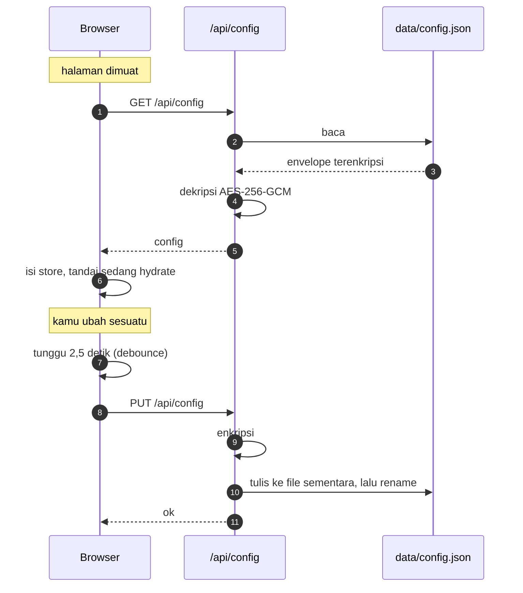

# 🔄 Sinkronisasi Config

> [!abstract] Masalah yang dipecahkan
> Provider, agent, dan sesi dulu hanya hidup di `localStorage`, jadi begitu kamu login dari laptop lain, workspace-nya kosong dan API key-nya hilang. Sekarang server jadi sumber kebenaran, dan `localStorage` tinggal jadi cache offline.

[[VMA|← Kembali ke Home]] · [[07 Keamanan]]

---

## 1. Yang Disinkronkan

| Data | Disinkronkan | Catatan |
| --- | --- | --- |
| Provider + base URL + **API key** | ya | terenkripsi |
| Model per provider | ya | |
| Provider moderator | ya | |
| Agent + persona + system prompt | ya | |
| Sesi dan namanya | ya | |
| Riwayat pesan | ya | |
| Dokumen knowledge base | tidak | disimpan di IndexedDB, tetap lokal per perangkat |

---

## 2. Alur



> [!info] Kenapa pakai `subscribe`, bukan memanggil dari store
> Store diamati dengan `subscribe` milik zustand. Kalau store yang memanggil modul sync, akan terjadi impor melingkar: store mengimpor sync, sync mengimpor store. Dengan `subscribe`, ketergantungannya satu arah saja.

> [!info] Kenapa ada penanda "sedang hydrate"
> Saat data server diterapkan ke store, perubahan itu akan memicu push balik ke server. Penanda ini mencegahnya, jadi tidak ada tulis-tulis yang tidak perlu.

---

## 3. Keamanan Penyimpanan

> [!important] File di disk tidak bisa dibaca tanpa kunci
> Seluruh payload dienkripsi dengan **AES-256-GCM**. Kuncinya diturunkan dari `VMA_CONFIG_KEY`, dan kalau kosong jatuh ke `VMA_SESSION_SECRET` yang sudah pasti ada di setiap deployment.

Hasil pengujian:

| Uji | Hasil |
| --- | --- |
| API key terlihat plaintext di file | tidak ada |
| Nama provider terlihat | tidak, terenkripsi penuh |
| Permission file | `-rw-------` (600) |
| Kunci benar | terdekripsi |
| Kunci salah atau kosong | gagal dibuka |
| Akses tanpa login | `401` |

> [!warning] Konsekuensi mengubah kunci
> Kalau `VMA_CONFIG_KEY` atau `VMA_SESSION_SECRET` diganti, config lama **tidak bisa dibaca lagi**. Sistem akan melaporkan peringatan, bukan crash, dan kamu memulai dari workspace kosong. Jadi set sekali, lalu simpan.

---

## 4. Ketahanan Penulisan

> [!note] Penulisan atomik
> Isi ditulis ke file sementara dulu, baru di-`rename` menimpa file target. Kalau proses mati di tengah penulisan biasa, file akan terpotong dan gagal di-parse saat boot berikutnya. Dengan `rename`, file lama tetap utuh sampai yang baru lengkap.

Batas ukuran payload **8 MB**. Kalau terlampaui, server menolak dengan pesan jelas, bukan menulis setengah.

---

## 5. Kalau Ada Masalah

> [!failure] Config tidak muncul di perangkat lain
> 1. Pastikan kamu login dengan akun yang sama
> 2. Buka `https://vma.yordangabriell.my.id/api/config` di browser. Kalau muncul `401`, sesinya sudah kedaluwarsa
> 3. Cek log: `docker compose logs --tail=50 vma`
> 4. Pastikan volume-nya ada: `docker volume ls | grep vma-data`

> [!failure] Muncul peringatan "could not be decrypted"
> Kunci enkripsi berubah. Config lama tidak bisa dibaca. Hapus `data/config.json` di volume dan mulai lagi, atau kembalikan kunci lamanya.

> [!failure] Volume tidak bisa ditulis
> Pastikan `/app/data` dimiliki user `nextjs` di dalam image. Dockerfile sudah membuatnya dengan `chown`, dan volume bernama mewarisi kepemilikan itu saat pertama dibuat.

---

## 6. Perintah Berguna

```bash
# Lihat isi volume tanpa membuka kunci (hanya envelope)
docker run --rm -v vma-data:/d alpine cat /d/config.json

# Ukuran config
docker run --rm -v vma-data:/d alpine ls -l /d/config.json

# Reset config
docker compose down
docker volume rm vma-data
docker compose up -d
```

> [!danger] Jangan pernah menyalin keluar `config.json` yang sudah didekripsi
> File itu berisi semua API key milikmu. Selama terenkripsi, ia tidak berguna tanpa kuncinya.

---

Terkait: [[07 Keamanan]] · [[06 Deployment]] · [[03 Model Data]]
