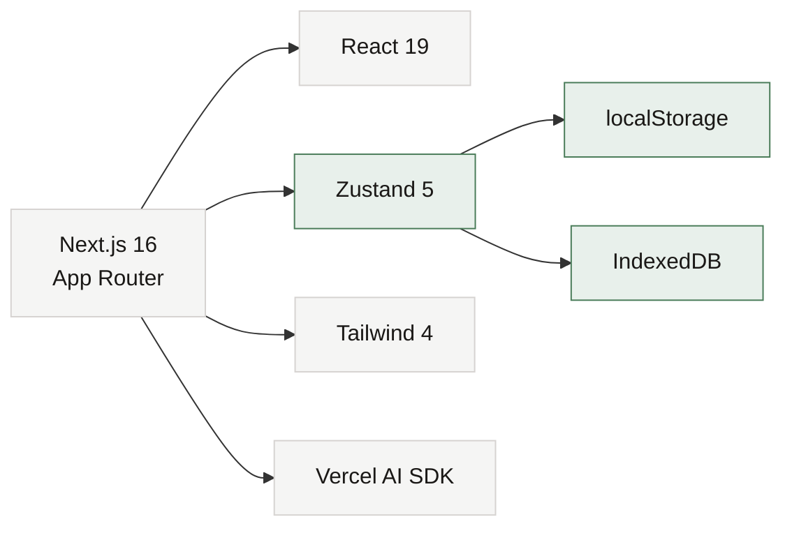

# 🏛️ VMA: Virtual Multi-Agent Debate

> [!abstract] Apa ini
> Satu pertanyaan masuk, lalu beberapa AI agent dengan persona dan keahlian berbeda **berdebat secara real-time** (streaming). Seorang **AI Moderator** opsional mengatur jalannya diskusi: memilih siapa yang bicara, menantang jawaban dangkal, dan menutup sesi dengan ringkasan terstruktur.

> [!success] Status
> **Live** di https://vma.yordangabriell.my.id
> Repo: https://github.com/yordangabriell12/mvp-multi-agent-debate

---

## 🗺️ Peta Dokumentasi

### Fondasi
| Catatan | Isi |
| --- | --- |
| [[01 Arsitektur]] | Stack, struktur folder, alur data, diagram sistem |
| [[02 Alur Debat]] | Siklus chat, 3 fase moderator, loop agentik |
| [[03 Model Data]] | Tipe TypeScript, store Zustand, penyimpanan |
| [[04 Fitur]] | Daftar fitur lengkap dan cara pakainya |

### Produk & Tampilan
| Catatan | Isi |
| --- | --- |
| [[05 Design System]] | Palet warna, tipografi, radius, animasi |

### Operasional
| Catatan | Isi |
| --- | --- |
| [[06 Deployment]] | Cara deploy ke VPS, runbook update |
| [[07 Keamanan]] | Login, anti brute force, SSRF, threat model |
| [[08 Troubleshooting]] | Masalah yang pernah muncul dan solusinya |
| [[09 Changelog]] | Riwayat perubahan |
| [[10 Sinkronisasi Config]] | API key ikut ke perangkat lain, enkripsi, volume data |
| [[11 Provider AI]] | Base URL, API key, Fetch models, arti pesan gagal |

### Referensi Asli
- `PRD.md` di root repo: Product Requirements Document lengkap
- `PRD-UI.md` di root repo: spesifikasi visual presisi

---

## ⚡ Ringkasan Cepat

> [!info] Nilai utama
> 1. **Debat multi-perspektif**: satu pertanyaan, jawaban dari 3+ sudut pandang ahli
> 2. **Moderator otonom**: AI yang memandu diskusi, bukan sekadar menjumlahkan jawaban
> 3. **BYOK**: pakai API key sendiri (OpenAI, Anthropic, OpenRouter, Ollama, custom)
> 4. **Anti vendor lock-in**: semua data di browser, tanpa database server
> 5. **Knowledge base per agent**: upload dokumen sebagai referensi

### Stack sekilas



---

## 🚀 Mulai Cepat

> [!example] Jalankan di lokal
> ```bash
> npm install
> npm run dev
> ```
> Buka http://localhost:3000, lalu isi API key lewat tombol **API Keys** di sidebar.

> [!tip] Deploy ke produksi
> Lihat [[06 Deployment]] untuk langkah lengkapnya dari nol sampai HTTPS aktif.

---

## 📌 Catatan Penting

> [!warning] Rahasia
> Kredensial login dan API key **tidak** ada di repo ini. Lihat [[Kredensial]] (file ini di-*gitignore*, tidak ikut ke GitHub).

---

## 📖 Cara Membuka di Obsidian

> [!example] Jadikan folder ini sebagai vault
> 1. Buka Obsidian, klik **Open folder as vault**
> 2. Pilih folder `docs/` di dalam repo
> 3. Mulai dari catatan ini, lalu ikuti tautannya
>
> Semua callout, wikilink, tabel, dan diagram Mermaid akan ter-render otomatis tanpa plugin tambahan.

> [!tip] Navigasi cepat
> - `Ctrl/Cmd + O`: lompat ke catatan mana pun
> - Klik tag seperti `#vma/ops` di panel kanan untuk memfilter
> - Graph view menampilkan peta hubungan antar catatan

---

*Dokumentasi ini dibuat untuk dibaca di Obsidian. Callout, wikilink, dan diagram Mermaid akan ter-render otomatis.*

